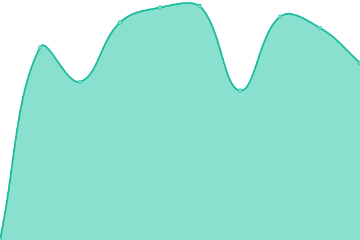
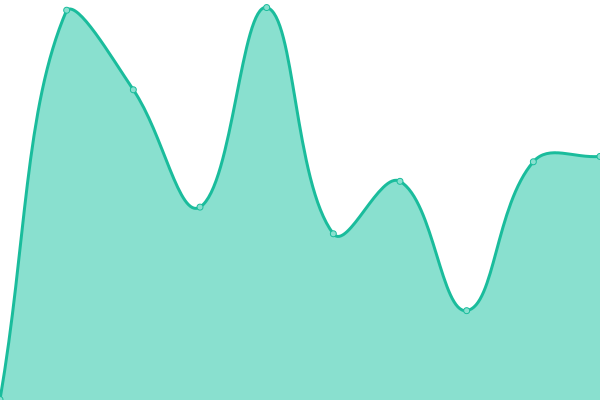
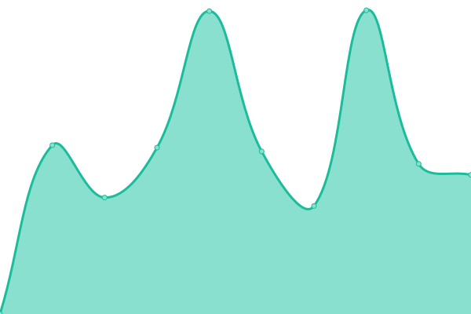
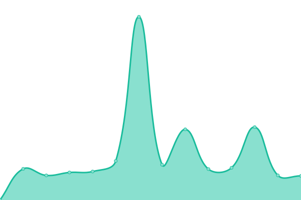

# [📈 Live Status](https://OtokoDB.github.io/upptime): <!--live status--> **🟩 All systems operational**

This repository contains the open-source uptime monitor and status page for [Otokonoko Database](https://otoko.eu.org), powered by [Upptime](https://github.com/upptime/upptime).

With [Upptime](https://upptime.js.org), you can get your own unlimited and free uptime monitor and status page, powered entirely by a GitHub repository. We use [Issues](https://github.com/OtokoDB/upptime/issues) as incident reports, [Actions](https://github.com/OtokoDB/upptime/actions) as uptime monitors, and [Pages](https://OtokoDB.github.io/upptime) for the status page.

<!--start: status pages-->
<!-- This summary is generated by Upptime (https://github.com/upptime/upptime) -->
<!-- Do not edit this manually, your changes will be overwritten -->
<!-- prettier-ignore -->
| URL | Status | History | Response Time | Uptime |
| --- | ------ | ------- | ------------- | ------ |
|  [DLGetchu](https://dl.getchu.com/) | 🟩 Up | [dl-getchu.yml](https://github.com/OtokoDB/upptime/commits/HEAD/history/dl-getchu.yml) | 

 1164ms
     
 | 

<a href="https://OtokoDB.github.io/upptime/history/dl-getchu">100.00%</a>
    

|  [DLsite](https://www.dlsite.com/) | 🟩 Up | [d-lsite.yml](https://github.com/OtokoDB/upptime/commits/HEAD/history/d-lsite.yml) | 

 560ms
     
 | 

<a href="https://OtokoDB.github.io/upptime/history/d-lsite">100.00%</a>
    

|  [Fanza(Regional)](https://www.dmm.co.jp/) | 🟩 Up | [fanza-regional.yml](https://github.com/OtokoDB/upptime/commits/HEAD/history/fanza-regional.yml) | 

 2863ms
     
 | 

<a href="https://OtokoDB.github.io/upptime/history/fanza-regional">100.00%</a>
    

|  [FC2](https://adult.contents.fc2.com/) | 🟩 Up | [fc-2.yml](https://github.com/OtokoDB/upptime/commits/HEAD/history/fc-2.yml) | 

 633ms
     
 | 

<a href="https://OtokoDB.github.io/upptime/history/fc-2">100.00%</a>
    

|  [Gyutto](http://gyutto.com/) | 🟩 Up | [gyutto.yml](https://github.com/OtokoDB/upptime/commits/HEAD/history/gyutto.yml) | 

 1781ms
     
 | 

<a href="https://OtokoDB.github.io/upptime/history/gyutto">100.00%</a>
    

|  [Pornhub](https://jp.pornhub.com/) | 🟩 Up | [pornhub.yml](https://github.com/OtokoDB/upptime/commits/HEAD/history/pornhub.yml) | 

 3844ms
     
 | 

<a href="https://OtokoDB.github.io/upptime/history/pornhub">99.58%</a>
    

|  [OtokoDB](https://otokodb.vercel.app) | 🟩 Up | [otoko-db.yml](https://github.com/OtokoDB/upptime/commits/HEAD/history/otoko-db.yml) | 

 198ms
     
 | 

<a href="https://OtokoDB.github.io/upptime/history/otoko-db">100.00%</a>
    

<!--end: status pages-->

[**Visit our status website →**](https://OtokoDB.github.io/upptime)

## 📄 License

- Powered by: [Upptime](https://github.com/upptime/upptime)
- Code: [MIT](./LICENSE) © [Otokonoko Database](https://otoko.eu.org)
- Data in the `./history` directory: [Open Database License](https://opendatacommons.org/licenses/odbl/1-0/)
